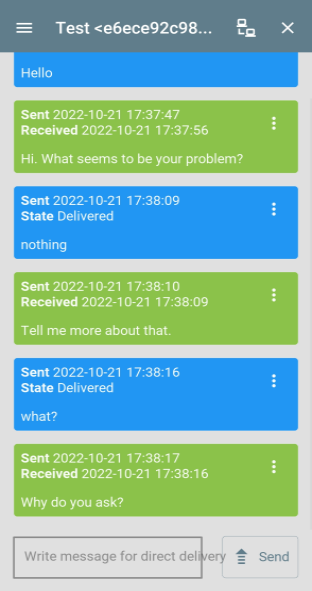

# lxmf_chatbot
Dieses Programm bietet einen einfachen Chatbot (RiveScript), der über LXMF kommunizieren kann.

Weitere Informationen finden Sie in den Konfigurationsoptionen (am Ende der Programmdateien). 
Alles Weitere ist dort kurz dokumentiert. 
Nach dem ersten Start wird diese Konfiguration als Standardkonfiguration in der entsprechenden Datei angelegt.


### Eigenschaften
- Kompatibel mit allen LXMF-Anwendungen (NomadNet, Sideband, ...)


## Beispiele für die Verwendung

### 

### Allgemeine Informationen zum Transport der Nachrichten
Alle Nachrichten zwischen Client<->Server werden als einzelne 1:1 Nachrichten im LXMF/Reticulum Netzwerk transportiert.
Dementsprechend findet zwischen diesen Endpunkten eine Verschlüsselung statt.
Wenn eine direkte Zustellung der Nachricht nicht funktioniert, wird sie an einen Propagationsknoten gesendet. Dort wird sie zwischengespeichert und kann später vom Client abgerufen werden.

Da es sich um normale LXMF-Nachrichten handelt, kann jede LXMF-fähige Anwendung zur Kommunikation mit der Gruppe verwendet werden.


## Aktueller Status
Die Software befindet sich noch in der Beta-Phase und ist noch nicht fertiggestellt.

Alle Kernfunktionen sind implementiert und funktionieren, aber Ergänzungen werden wahrscheinlich auftreten, wenn die praktische Anwendung erforscht wird.

Es kann zu Fehlern kommen oder die Kompatibilität nach einem Update ist nicht mehr gewährleistet.

Die vollständige Dokumentation ist noch nicht verfügbar. Aus Zeitmangel kann ich auch nicht sagen, wann diese weiterbearbeitet werden wird.


## Screenshots / Usage examples



## Installations Handbuch

### Installation:
- Installieren Sie alle erforderlichen Voraussetzungen. 
(Standardinstallation von Reticulum. Nur erforderlich, wenn Reticulum noch nicht installiert ist).

  ```bash
  apt update
  apt upgrade
  
  apt install python3-pip
  
  pip install pip --upgrade
  reboot
  
  pip3 install rns
  pip3 install pyserial netifaces
  
  pip3 install lxmf
  ```
- Ändern Sie die Reticulum-Konfiguration entsprechend Ihren Anforderungen und Ihrem Anwendungsfall.
  ```bash
  nano /.reticulum/config
  ```
- Laden Sie die [Datei](lxmf_chatbot.py) aus diesem Repository herunter.
  ```bash
  wget https://raw.githubusercontent.com/SebastianObi/LXMF-Tools/main/lxmf_chatbot/lxmf_chatbot.py
  ```
- Machen Sie es mit folgendem Befehl ausführbar
  ```bash
  chmod +x lxmf_chatbot.py
  ```

### Starten:
- Starten mit
  ```bash
  ./lxmf_chatbot.py
  ```
- Nach dem ersten Start bearbeiten Sie die Konfigurationsdatei, um sie an Ihre Bedürfnisse und Ihren Anwendungsfall anzupassen. 
Der Speicherort der Datei wird angezeigt.
- Beispiel einer Minimalkonfiguration 
(Überschreibung der Standardkonfiguration `config.cfg`). 
Dies sind die wichtigsten Einstellungen, die angepasst werden müssen. 
Alle anderen Einstellungen befinden sich in `config.cfg`.
  ```bash
  nano /root/.lxmf_chatbot/config.cfg.owr
  ```
  ```bash
  ```
- Starten Sie erneut. Fertig!
  ```bash
  ./lxmf_chatbot.py
  ```


### Als Systemdienst/Dämon ausführen:
- Erstellen Sie eine Servicedatei.
  ```bash
  nano /etc/systemd/system/lxmf_chatbot.service
  ```
- Kopieren Sie den folgenden Inhalt und passen Sie ihn an Ihre eigenen Bedürfnisse an.
  ```bash
  [Unit]
  Description=lxmf_chatbot
  After=multi-user.target
  [Service]
  # ExecStartPre=/bin/sleep 10
  Type=simple
  Restart=always
  RestartSec=3
  User=root
  ExecStart=/root/lxmf_chatbot.py
  [Install]
  WantedBy=multi-user.target
  ```
- Aktivieren Sie den Dienst.
  ```bash
  systemctl enable lxmf_chatbot
  ```
- Starten Sie den Dienst.
  ```bash
  systemctl start lxmf_chatbot
  ```


### Dienst starten/stoppen:
  ```bash
  systemctl start lxmf_chatbot
  systemctl stop lxmf_chatbot
  ```


### Aktivieren/Deaktivieren des Dienstes:
  ```bash
  systemctl enable lxmf_chatbot
  systemctl disable lxmf_chatbot
  ```


### Mehrere Instanzen ausführen (um dieselbe Anwendung zu kopieren):
- Führen Sie das Programm mit einem anderen Konfigurationspfad aus.
  ```bash
  ./lxmf_chatbot.py -p /root/.lxmf_chatbot_2nd
  ./lxmf_chatbot.py -p /root/.lxmf_chatbot_3nd
  ```
- Nach dem ersten Start bearbeiten Sie die Konfigurationsdatei, um sie an Ihre Bedürfnisse und Ihren Anwendungsfall anzupassen. Der Speicherort der Datei wird angezeigt.


### Erste Verwendung:
- Bei einem manuellen Start über die Konsole wird die eigene LXMF-Adresse angezeigt:
  ```
  [] ...............................................................................
  [] LXMF - Address: <801f48d54bc71cb3e0886944832aaf8d>
  [] ...............................................................................`
  ```
- In der Standardeinstellung wird diese Adresse auch beim Start bekannt gegeben.
- Nun kann die Software verwendet werden.


### Parameter für die Inbetriebnahme:
```bash
usage: lxmf_chatbot.py [-h] [-p PATH] [-pr PATH_RNS] [-pl PATH_LOG] [-l LOGLEVEL] [-s] [--exampleconfig] [--exampleconfigoverride]

LXMF Chatbot - Simple chatbot (RiveScript) für LXMF messages

optionale Argumente:
  -h, --help            diese Hilfemeldung anzeigen und beenden
  -p PATH, --path PATH  Pfad zum alternativen Konfigurationsverzeichnis
  -pr PATH_RNS, --path_rns PATH_RNS
                        Pfad zum alternativen Reticulum-Konfigurationsverzeichnis
  -pl PATH_LOG, --path_log PATH_LOG
                        Pfad zum alternativen Protokollverzeichnis
  -l LOGLEVEL, --loglevel LOGLEVEL
  -s, --service         Läuft als Dienst und sollte sich in der Datei
  --exampleconfig       Ausführliches Konfigurationsbeispiel nach stdout ausgeben und beenden
  --exampleconfigoverride
                        Ausführliches Konfigurationsbeispiel nach stdout ausgeben und beenden
```


### Configurationsdaten Dateien:
- config.cfg
  
  Dies ist die Standardkonfigurationsdatei.

- config.cfg.owr
  
  Dies ist die Benutzerkonfigurationsdatei, die die Standardkonfigurationsdatei außer Kraft setzt.
  Alle hier vorgenommenen Einstellungen haben Vorrang.
  In dieser Datei können alle vom Standard abweichenden Einstellungen übersichtlich zusammengefasst werden.
  Dies hat auch den Vorteil, dass alle geänderten Einstellungen bei einer Aktualisierung des Programms beibehalten werden können.


## Konfigurationshandbuch (Beispiele)
Die hier gezeigten Konfigurationen sind nur ein Teil der Gesamtkonfiguration.
Sie dienen nur dazu, die für die jeweilige Funktion notwendige und angepasste Konfiguration zu zeigen.
Alle Konfigurationen müssen in der Datei `config.cfg.owr` vorgenommen werden.
Alle möglichen Einstellungen sind in der Standard-Konfigurationsdatei `config.cfg` zu sehen.


## Admin Handbuch
Dieser Leitfaden gilt für alle Admins. Hier werden die administrativen Möglichkeiten kurz erläutert.


## User Handbuch
Diese Anleitung gilt für Benutzer oder Administratoren. Hier werden kurz die normalen Möglichkeiten der Software erklärt.


## FAQ

### Wie kann ich mit der Software beginnen?
Sie sollten den Abschnitt `Installationsanleitung` lesen. Dort ist alles kurz erklärt. Gehen Sie einfach alles von oben nach unten durch :)