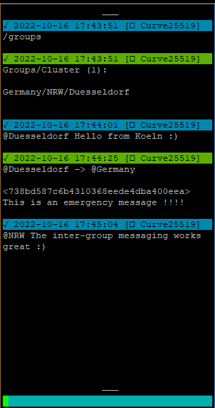
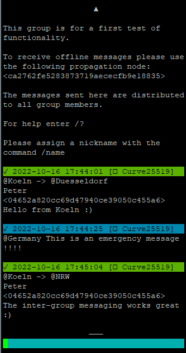
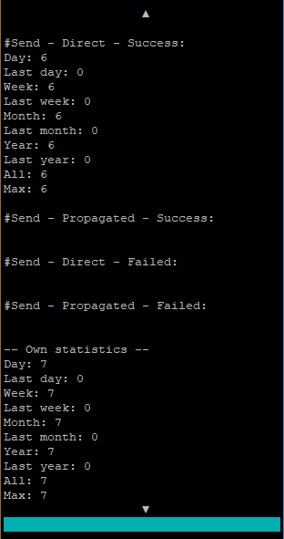
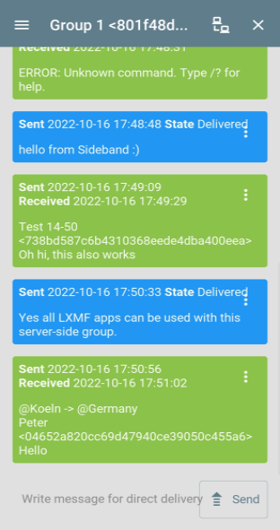

# lxmf_distribution_group
This program provides an email like distribution group. It will distribute incoming LXMF messages to multiple recipients. Since this program acts as a normal LXMF endpoint, all compatible chat applications can be used. In addition to simple messaging, there is a simple command-based user interface. Where all relevant actions for daily administration can be performed. The basic configuration is done in the configuration files. There are various options to adapt the entire behavior of the group to personal needs. This distribution group is much more than a standard email distribution group. It emulates advanced group functions with automatic notifications etc. Different user permissions can be defined. For each user type, the range of functions can be defined individually. The normal users have only small rights. While a moderator or admin can perform everything necessary by simple commands. Once the basic configuration is done, everything else can be done by LXMF messages as commands.

For more information, see the configuration options (at the end of the program files). Everything else is briefly documented there. After the first start this configuration will be created as default config in the corresponding file.


### Features
- Compatible with all LXMF applications (NomadNet, Sideband, ...)
- Server/Node based message routing and processing
- Direct or propagated message delivery (receive/send)
- Simple group functions (As in other messenger apps)
- User authorization and permissions
- Different user types with different permissions
- Automatic or manual group joining
- Text based interface to display advanced functions or infos
- Cluster of several groups (communication between groups with different levels)
- Automatic negotiation of the clusters
- Statistics at cluster, router, group and user level
- Easy configuration within readable config files
- Various admin commands for the daily tasks to be controlled via LXMF messages
- Group description, rules and pinned messages
- Optional enableable waiting room for new members before joining the group
- Multiple language support (English & German are predifined)


## Examples of use

### Local self-sufficient group
In a small group of people, this group software can be hosted on a centrally located node. This then allows users to communicate with each other via this group.

### Multiple local self-sufficient group
On the same node/server several groups can be operated independently of each other. How this works is described below in the installation instructions.

### Networking groups as a cluster
It is possible to connect several locally independent groups to a cluster. This makes it possible to send messages from one group to another.

### Hierarchical cluster groups over widely spread areas
A group cluster can be built in several levels. A group can be labeled with several names according to the naming of the levels.
This makes it possible, for example to send a messages to several groups at the same time. So you could define the cluster names as follows. `Country/Region/City`
With this it is possible to contact all groups of a certain country or region.

### General info how the messages are transported
All messages between client<->group-server and group-server<->group-server are transported as single 1:1 messages in the LXMF/Reticulum network.
Accordingly, encryption takes place between these end points.
If a direct delivery of the message does not work, it is sent to a propagation node. There it is stored temporarily and can be retrieved by the client later.

As these are normal LXMF messages, any LXMF capable application can be used to communicate with the group.

When a message is sent to a multi-level (hierarchical) cluster. A 1:1 connection is always established from the source to each target group in this cluster level.

There is no central server for communication between the individual groups. This offers the advantage that all groups work autonomously. A failure of a group only affects this one local group. 


## Current Status
It should currently be considered beta software. All core features are implemented and functioning, but additions will probably occur as real-world use is explored. There will be bugs.
The full documentation is not yet available. Due to lack of time I can also not say when this will be further processed.


## Development Roadmap
- Planned, but not yet scheduled
  - Propagation Node fallback
  - Propagation Node auto discover
  - Propagation Node auto select
  - Parameters for backup/restore configuration and data
  - Parameters for backup/restore identity
  - Cluster bridges/repeater
  - Different message priorities
  - Fallback solution: Master/Slave
  - Centralized user/group authorization
  - Internal queue with prioritization
  - More intelligent messages sending
  - Command to display the send status of the last message
  - Automatic send confirmation
  - Complete documentation


## Screenshots / Usage examples



## Installation manual

### Install:
- Install all required prerequisites. (Default Reticulum installation. Only necessary if reticulum is not yet installed.)
  ```bash
  apt update
  apt upgrade
  
  apt install python3-pip
  
  pip install pip --upgrade
  reboot
  
  pip3 install rns
  pip3 install pyserial netifaces
  
  pip3 install lxmf
  ```
- Change the Reticulum configuration to suit your needs and use-case.
  ```bash
  nano /.reticulum/config
  ```
- Download the [file](lxmf_distribution_group.py) from this repository.
  ```bash
  wget https://raw.githubusercontent.com/SebastianObi/LXMF-Tools/main/lxmf_distribution_group/lxmf_distribution_group.py
  ```
- Make it executable with the following command
  ```bash
  chmod +x lxmf_distribution_group.py
  ```

### Start:
- Start it
  ```bash
  ./lxmf_distribution_group.py
  ```
- After the first start edit the configuration file to suit your needs and use-case. The file location is displayed.
- Example minimal configuration (override of the default config `config.cfg`). These are the most relevant settings that need to be adjusted. All other settings are in `config.cfg`
  ```bash
  nano /root/.lxmf_distribution_group/config.cfg.owr
  ```
  ```bash
  # This is the user configuration file to override the default configuration file.
  # All settings made here have precedence.
  # This file can be used to clearly summarize all settings that deviate from the default.
  # This also has the advantage that all changed settings can be kept when updating the program.
  
  
  #### Main program settings ####
  [main]
  
  # Default language.
  lng = en # en/de
  
  
  #### LXMF connection settings ####
  [lxmf]
  
  # The name will be visible to other peers
  # on the network, and included in announces.
  # It is also used in the group description/info.
  display_name = Distribution Group
  
  # Propagation node address/hash.
  propagation_node = ca2762fe5283873719aececfb9e18835
  
  # Try to deliver a message via the LXMF propagation network,
  # if a direct delivery to the recipient is not possible.
  try_propagation_on_fail = Yes
  
  
  #### Cluster settings ####
  [cluster]
  
  # Enable/Disable this functionality.
  enabled = True
  
  # To use several completely separate clusters/groups,
  # an individual name and type can be assigned here.
  name = grp
  type = cluster
  
  # Slash-separated list with the names of this cluster.
  # No spaces are allowed in the name.
  # All send messages that match the name will be received.
  # The last name is the main name of this group
  # and is used as source for send messages.
  display_name = County/Region/City
  
  
  #### Statistic/Counter settings ####
  [statistic]
  
  # Enable/Disable this functionality.
  enabled = True
  ```
- Start it again. Finished!
  ```bash
  ./lxmf_distribution_group.py
  ```


### Run as a system service/deamon:
- Create a service file.
  ```bash
  nano /etc/systemd/system/lxmf_distribution_group.service
  ```
- Copy and edit the following content to your own needs.
  ```bash
  [Unit]
  Description=lxmf_distribution_group.py Daemon
  After=multi-user.target
  [Service]
  # ExecStartPre=/bin/sleep 10
  Type=simple
  Restart=always
  RestartSec=3
  User=root
  ExecStart=/root/lxmf_distribution_group.py
  [Install]
  WantedBy=multi-user.target
  ```
- Enable the service.
  ```bash
  systemctl enable lxmf_distribution_group
  ```
- Start the service.
  ```bash
  systemctl start lxmf_distribution_group
  ```


### Start/Stop service:
  ```bash
  systemctl start lxmf_distribution_group
  systemctl stop lxmf_distribution_group
  ```


### Enable/Disable service:
  ```bash
  systemctl enable lxmf_distribution_group
  systemctl disable lxmf_distribution_group
  ```


### Run several instances (To copy the same application):
- Run the program with a different configuration path.
  ```bash
  ./lxmf_distribution_group.py -p /root/.lxmf_distribution_group_2nd
  ./lxmf_distribution_group.py -p /root/.lxmf_distribution_group_3nd
  ```
- After the first start edit the configuration file to suit your needs and use-case. The file location is displayed.


### First usage:
- With a manual start via the console, the own group LXMF address is displayed:
  ```
  [] ...............................................................................
  [] LXMF - Address: <801f48d54bc71cb3e0886944832aaf8d>
  [] ...............................................................................`
  ```
- This address is also annouced at startup in the default setting.
- If auto add user is active (default) you can simply send a first message via Sideband/NomadNet to this address. After that you are a member of the group and can use the functions.
- Alternatively, the users can also be entered manually in the `data.cfg` file. It is necessary to add an admin user here to use all commands via LXMF messages!
- Now the group can be used.


### Startup parameters:
```bash
usage: lxmf_distribution_group.py [-h] [-p PATH] [-pr PATH_RNS] [-pl PATH_LOG] [-l LOGLEVEL] [-s] [--exampleconfig] [--exampleconfigoverride] [--exampledata]

LXMF Distribution Group - Server-Side group functions for LXMF based apps

optional arguments:
  -h, --help            show this help message and exit
  -p PATH, --path PATH  Path to alternative config directory
  -pr PATH_RNS, --path_rns PATH_RNS
                        Path to alternative Reticulum config directory
  -pl PATH_LOG, --path_log PATH_LOG
                        Path to alternative log directory
  -l LOGLEVEL, --loglevel LOGLEVEL
  -s, --service         Running as a service and should log to file
  --exampleconfig       Print verbose configuration example to stdout and exit
  --exampleconfigoverride
                        Print verbose configuration example to stdout and exit
  --exampledata         Print verbose configuration example to stdout and exit
```


### Config/data files:
- config.cfg
  
  This is the default config file.

- config.cfg.owr
  
  This is the user configuration file to override the default configuration file.
  All settings made here have precedence.
  This file can be used to clearly summarize all settings that deviate from the default.
  This also has the advantage that all changed settings can be kept when updating the program.

- data.cfg
  
  This is the data file. It is automatically created and saved/overwritten.
  It contains data managed by the software itself.
  If manual adjustments are made here, the program must be shut down first!


## Configuration manual (Examples)
The configurations shown here are only a part of the total configuration.
It only serves to show the configuration that is necessary and adapted for the respective function.
All configurations must be made in the file `config.cfg.owr`.
All possible settings can be seen in the default configuration file `config.cfg`.


### Cluster:
This example shows the configuration for a cluster with 2 groups. This allows communication between both groups.
It is possible to write directly to each group or to the higher level which then includes both groups.

- Group #1 `config.cfg.owr`
  ```
  [lxmf]
  display_name = Group Test 1
  [cluster]
  enabled = True
  name = test
  type = cluster
  display_name = Germany/NRW/Düsseldorf
  ```

- Group #1 `data.cfg`
  ```
  [main]
  enabled_cluster = True
  auto_add_cluster = True
  ```

- Group #2 `config.cfg.owr`
  ```
  [lxmf]
  display_name = Group Test 2
  [cluster]
  enabled = True
  name = test
  type = cluster
  display_name = Germany/Bayern/München
  ```

- Group #2 `data.cfg`
  ```
  [main]
  enabled_cluster = True
  auto_add_cluster = True
  ```


### 2 independent cluster:
This example shows the configuration for 2 separate clusters.
This makes it possible to operate several clusters in parallel via the same communication network.
It is important to configure the `name` and `type` differently.

- Cluster #1 - Group #1 `config.cfg.owr`
  ```
  [lxmf]
  display_name = Group Test 1
  [cluster]
  enabled = True
  name = test1
  type = cluster
  display_name = Germany/NRW/Düsseldorf
  ```

- Cluster #1 - Group #1 `data.cfg`
  ```
  [main]
  enabled_cluster = True
  auto_add_cluster = True
  ```

- Cluster #2 - Group #1 `config.cfg.owr`
  ```
  [lxmf]
  display_name = Group Test 1
  [cluster]
  enabled = True
  name = test2
  type = cluster
  display_name = Germany/NRW/Düsseldorf
  ```

- Cluster #2 - Group #1 `data.cfg`
  ```
  [main]
  enabled_cluster = True
  auto_add_cluster = True
  ```


### Members/Clusters:
Normally all data here (`data.cfg`) is created automatically by the software. Based on automatic creation of new users/clusters or executed commands for administration.
Here are a few examples of how the content can look. Of course, the file can also be edited manually. This is necessary if an auto add is disabled.
Please do not forget to close the program first!

- Group #1 `data.cfg`
  ```
  [user]
  04652a820cc69d47940ce39050c455a6 = Test User 1
  
  [cluster]
  d1b551e1b89fff5a4a6f2aaff2464971 = Germany/Bayern/München
    ```

- Group #2 `data.cfg`
  ```
    [user]
  18201a931dd69d47940ce39050c487c9 = Test User 1
  
  [cluster]
  801f48d54bc71cb3e0886944832aaf8d = Germany/NRW/Düsseldorf
    ```


### Waiting room for new members:
This example shows the configuration for a waiting room for new members.
When an unknown user joins the group by the first message to the group, he is added to the "wait" type.
There he will be in a kind of waiting room where no messages can be written and received.
An admin or moderator can then allow or disallow this user.

The configuration shows only the minimum necessary part for this functionality. Of course, further rights can be assigned to the users.

- `config.cfg.owr`
  ```
  [rights]
  admin = interface,receive_join,allow,deny
  mod = interface,receive_join,allow,deny
  wait = 
  
  [interface_messages]
  auto_add_wait = Welcome to the group "!display_name!"!!n!!n!You still need to be allowed to join. You will be notified automatically.
  auto_add_wait-de = Willkommen in der Gruppe "!display_name!"!!n!!n!Der Beitritt muss ihnen noch erlaubt werden. Sie werden darüber automatisch benachrichtigt.
  
  allow_user = You have been allowed to join the group "!display_name!"!!n!!n!!description!!n!!n!The messages sent here are distributed to all group members.!n!!n!For help enter /?!n!!n!To read the group rules use the command /rules!n!!n!Please assign a nickname with the command /name
  allow_user-de = Sie wurden erlaubt der Gruppe "!display_name!" beizutreten!!n!!n!!description!!n!!n!Die hier gesendeten Nachrichten werden an alle Gruppenmitglieder verteilt.!n!!n!Für Hilfe geben Sie /? ein.!n!!n!Um die Gruppenregeln zu lesen verwenden Sie den Befehl /rules!n!!n!Bitte vergeben Sie einen Nickname mit dem Befehl /name
  
  deny_user = You have been denied to join the group "!display_name!"!
  deny_user-de = Ihnen wurde der Beitritt in die Gruppe "!display_name!" abgelehnt!
  
  member_join = !source_name! <!source_address!> joins the waiting room and must be allowed to join the group.
  member_join-de = !source_name! <!source_address!> betritt den Warteraum und muss zur Gruppe zugelassen werden.
  ```

- `data.cfg`
  ```
  [main]
  auto_add_user = True
  auto_add_user_type = wait
  allow_user = True
  allow_user_type = user
  deny_user = True
  deny_user_type = block_wait
  ```


## Admin manual
This guide applies to all admins. Here are briefly explained the administative possibilities.

An administartor has correspondingly higher permissions and more commands are available. In general, the permissions can be freely defined. All users/admins etc. can also generally have the same permissions.


### Activate/deactivate functions:
The following functions can be adjusted accordingly by command.

`/enable_local <true/false>` = Local message routing

`/enable_cluster <true/false>` = Cluster message routing

`/auto_add_user <true/false>` = Add unknown user functionality

`/auto_add_cluster <true/false>` = Add unknown cluster functionality


### Change values:
`/description <description>` = Change description

`/rules <description>` = Change rules


### Send a manual announce of the group and cluster:
`/announce`


### Manage users (display of existing users):
`/show or /list`

`/show or /list <admin/mod/user/guest>`

`/search <nickname/user_address>`


### Manage users (invite):
Additional users can be invited, this can be done with the command `/invite <user_address>`.
Then the user gets a welcome message and enters the group.


### Manage users (allow/deny):
If the waiting room is activated, the users can be administered with the following 2 commands.

`/allow <user_address>`

`/deny <user_address>`


### Manage users (add/delete/move):
The following commands can be used to administrate the users.
Only in case of an invite a welcome message will be sent to the user. Users added here will not get a notification and have to start the first conversation with the group themselves. Or get a message sent directly.

`/add <admin/mod/user/guest> <user_address> <user_name>`

`/del or /rm <admin/mod/user/guest> <user_address>`

`/del or /rm <user_address>`

`/move <admin/mod/user/guest> <user_address>`


### Manage users (kick/block/unblock):
The following commands can be used to remove/enable the users.

`/kick <user_address>`

`/block <user_address>`

`/unblock <user_address>`


### Save data:
If an automatic save is set in the config nothing has to be done here. If not or additionally the data can be saved with the following command.

`/save`


### Help:
To display the help and all available commands the following commands can be used. `/help` or `/?`


### Examples of possible commands:
```
/help or /? = Shows this help
/leave or /part = Leave group
/name = Show current nickname
/nick = Show current nickname
/name <your nickname> = Change/Define nickname
/nick <your nickname> = Change/Define nickname
/address = Dislay address info
/info = Show group info
/description = Show current description
/rules = Show current rules
/version = Show version info
/groups or /cluster = Show all groups/clusters
/groups <name> = Searches for a group/cluster by name
/members or /names or /who = Show all group members
/admins = Show group admins
/moderators or /mods = Show group moderators
/users = Show group users
/guests = Show group guests
/search <nickname/user_address> = Searches for a user by nickname or address
/whois <nickname/user_address> = Searches for a user by nickname or address
/activitys = Show user activitys
/statistic or /stat = Show group statistic
/status = Show status
/delivery or /message = Show delivery status of last message
/enable_local <true/false> = Local message routing
/enable_cluster <true/false> = Cluster message routing
/auto_add_user <true/false> = Add unknown user functionality
/auto_add_user_type <admin/mod/user/guest>
/auto_add_cluster <true/false> = Add unknown cluster functionality
/invite_user <true/false> = Invite functionality
/invite_user_type <admin/mod/user/guest>
/description <description> = Change description
/rules <description> = Change rules
/announce = Send announce
/sync = Synchronize messages with propagation node
/show run = Show current configuration
/show or /list
/show or /list <admin/mod/user/guest>
/add <admin/mod/user/guest> <user_address> <user_name>
/del or /rm <admin/mod/user/guest> <user_address>
/del or /rm <user_address>
/move <admin/mod/user/guest> <user_address>
/invite <user_address> = Invites user to group
/kick <user_address> = Kicks user out of group
/block <user_address> = Block user
/ban <user_address> = Block user
/unblock <user_address> = Unblock user
/unban <user_address> = Unblock user
/load or /read = Read the configuration/data
/save or /wr = Saves the current configuration/data
```


## User manual
This guide applies to users or admins. Here are briefly explained the normal possibilities of the software.


### Start/Join the group:
Just send a first message to the group address with Sideband/NomadNet.
However, this is only possible if automatic joining of the group is activated.


### Send local group message:
Any normal text without `/` or `@` at the beginning will be interpreted as a normal message and sent to all local members accordingly. There is nothing else to consider here.


### Send cluster message:
It is possible to send messages to other groups which are part of the cluster. To do this you must first enter the command `@` followed by the target name of the group and then the normal message text.

For example `@Berlin Hello this is a test :)`. So this example would send this message to the Berlin group.

A group in a cluster can be arranged hierarchically in different levels. If the higher level is defined as the target, all groups below it receive this message.

For example, there are the following 3 groups `Germany/Berlin` and `Germany/Hamburg` and `Germany/Munich`. Accordingly, these can be written to directly or a higher level.

With the command `@Germany ` all 3 groups are now accessible. With the command `@Munich ` only this one group is accessible.


### Pin message (local group):
It is possible to pin local group messages permanently. This will then sent to all members. Additionally, all pinned messages can be displayed later.

This feature is useful to give new members access to important news from the past.

`/pin` = Display all pinned messages

`/pin <message text>` = Pin a new message

`/unpin <#id>` = Remove a pinned message


### Pin message (cluster group):
It is possible to pin cluster group messages permanently. This will then sent to all members. Additionally, all pinned messages can be displayed later.

This feature is useful to give new members access to important news from the past.

`@Group /pin <message text>` = Pin a new message


### Interface/Commands:
A simple text-message based user interface is integrated. Like you might know it from other chat programs. Every command must start with the delimiter `/`. Then followed by the command and any data. For example `/name My new nick name`.

If there is no `/` at the beginning this is a normal message and will be sent to the other members.


### Help:
To display the help and all available commands the following commands can be used. `/help` or `/?`


### Leave the group:
The `/leave` command is used to leave the group. Afterwards, the group can be re-entered (if it is allowed).


### Invite users:
If the admin has allowed additional users to be invited, this can be done with the command `/invite <user_address>`.
Then the user gets a welcome message and enters the group.


### Change nickname:
The own nickname is either assigned automatically via received announce (after joining the group) or can be changed via the following command.

`/name <your new nnockname>` For example `/name Max Walker`.


### Examples of possible commands:
```
/help or /? = Shows this help
/leave or /part = Leave group
/name = Show current nickname
/nick = Show current nickname
/name <your nickname> = Change/Define nickname
/nick <your nickname> = Change/Define nickname
/address = Dislay address info
/info = Show group info
/description = Show current description
/rules = Show current rules
/version = Show version info
/groups or /cluster = Show all groups/clusters
/groups <name> = Searches for a group/cluster by name
/members or /names or /who = Show all group members
/admins = Show group admins
/moderators or /mods = Show group moderators
/users = Show group users
/guests = Show group guests
/search <nickname/user_address> = Searches for a user by nickname or address
/whois <nickname/user_address> = Searches for a user by nickname or address
/activitys = Show user activitys
/statistic or /stat = Show group statistic
/delivery or /message = Show delivery status of last message
/invite <user_address> = Invites user to group
```


## FAQ

### Why this server based group function and no direct groups in the client software?
At the time of the development of these group functions there is no other possibility to use groups via Sideband/Nomadnet. Therefore this software was developed as a workaround.
This software also offers other functions than a normal group broadcast.

### How do I start with the software?
You should read the `Installation manual` section. There everything is explained briefly. Just work through everything from top to bottom :)