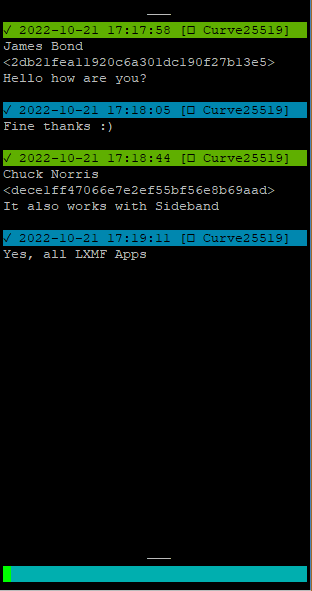
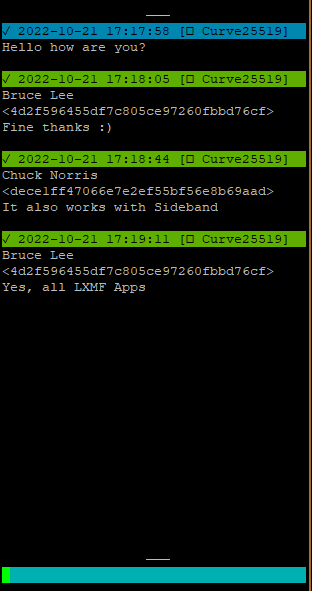
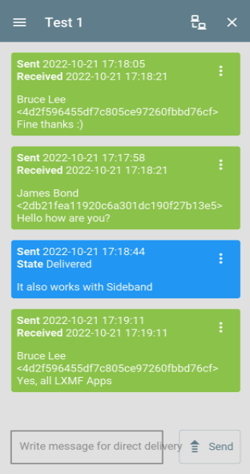

# lxmf_distribution_group_minimal
Dieses Programm ist eine minimalistische Version der normalen Verteilungsgruppe. Die Funktionalität ist auf ein Minimum reduziert. Es können nur Absender und Empfänger definiert werden. Die Nachrichten werden dann entsprechend an die anderen Benutzer gesendet. Es gibt keine Benutzeroberfläche oder sonstige Benachrichtigungen. Lediglich die Nachrichten werden 1:1 verteilt. Die Verwaltung erfolgt komplett über die jeweiligen Konfigurationsdateien, die entsprechend zu bearbeiten sind.

Weitere Informationen finden Sie in den Konfigurationsoptionen (am Ende der Programmdateien). Alles Weitere ist dort kurz dokumentiert. Nach dem ersten Start wird diese Konfiguration als Standardkonfiguration in der entsprechenden Datei angelegt.


### Merkmale
- Kompatibel mit allen LXMF-Anwendungen (NomadNet, Sideband, ...)
- Server-/Node-basierte Nachrichtenweiterleitung und -verarbeitung
- Direkte oder propagierte Nachrichtenzustellung (Empfang/Sendung)
- Einfache Verteilung von eingehenden Nachrichten an Empfänger


## Beispiele für die Verwendung

### Lokale autarke Gruppe
In einer kleinen Gruppe von Personen kann diese Gruppensoftware auf einem zentral gelegenen Knoten gehostet werden. Dies ermöglicht es den Nutzern, über diese Gruppe miteinander zu kommunizieren.

### Mehrere lokale autarke Gruppen
Auf demselben Knoten/Server können mehrere Gruppen unabhängig voneinander betrieben werden. Wie das funktioniert, wird weiter unten in der Installationsanleitung beschrieben.

### Allgemeine Informationen zum Transport der Nachrichten
Alle Nachrichten zwischen Client<->Gruppenserver werden als einzelne 1:1 Nachrichten im LXMF/Reticulum Netzwerk transportiert.
Dementsprechend findet zwischen diesen Endpunkten eine Verschlüsselung statt.
Wenn eine direkte Zustellung der Nachricht nicht funktioniert, wird sie an einen Propagationsknoten gesendet. Dort wird sie zwischengespeichert und kann später vom Client abgerufen werden.

Da es sich um normale LXMF-Nachrichten handelt, kann jede LXMF-fähige Anwendung zur Kommunikation mit der Gruppe verwendet werden.


## Aktueller Status
Es handelt sich derzeit um eine Betasoftware, die noch in Arbeit ist.

Alle Kernfunktionen sind implementiert und funktionieren, aber Ergänzungen werden wahrscheinlich auftreten, wenn die reale Nutzung erforscht wird.

Es kann zu Fehlern kommen oder die Kompatibilität nach einem Update ist nicht mehr gewährleistet.

Die vollständige Dokumentation ist noch nicht verfügbar. Aus Zeitmangel kann ich auch nicht sagen, wann diese weiterbearbeitet werden wird.


## Bilder / Beispiele für den Gebrauch



## Installations Handbuch

### Installation:
- Installieren Sie alle erforderlichen Voraussetzungen. 
(Standardinstallation von Reticulum. Nur erforderlich, wenn Reticulum noch nicht installiert ist).
  ```bash
  apt update
  apt upgrade
  
  apt install python3-pip
  
  pip install pip --upgrade
  reboot
  
  pip3 install rns
  pip3 install pyserial netifaces
  
  pip3 install lxmf
  ```
- Ändern Sie die Reticulum-Konfiguration entsprechend Ihren Anforderungen und Ihrem Anwendungsfall.
  ```bash
  nano /.reticulum/config
  ```
- Laden Sie die [Datei](lxmf_distribution_group_minimal.py) aus diesem Repository herunter.
  ```bash
  wget https://raw.githubusercontent.com/SebastianObi/LXMF-Tools/main/lxmf_distribution_group_minimal/lxmf_distribution_group_minimal.py
  ```
- Machen Sie es mit folgendem Befehl ausführbar
  ```bash
  chmod +x lxmf_distribution_group_minimal.py
  ```

### Starten:
- Starten mit
  ```bash
  ./lxmf_distribution_group_minimal.py
  ```
- Nach dem ersten Start bearbeiten Sie die Konfigurationsdatei, um sie an Ihre Bedürfnisse und Ihren Anwendungsfall anzupassen. Der Speicherort der Datei wird angezeigt.
- Beispiel einer Minimalkonfiguration (Überschreibung der Standardkonfiguration `config.cfg`). Dies sind die wichtigsten Einstellungen, die angepasst werden müssen. Alle anderen Einstellungen befinden sich in `config.cfg`.
  ```bash
  nano /root/.lxmf_distribution_group_minimal/config.cfg.owr
  ```
  ```bash
  # Dies ist die Benutzerkonfigurationsdatei, die die Standardkonfigurationsdatei außer Kraft setzt.
  # Alle hier vorgenommenen Einstellungen haben Vorrang.
  # Diese Datei kann verwendet werden, um alle Einstellungen, die vom Standard abweichen, übersichtlich zusammenzufassen.
  # Dies hat auch den Vorteil, dass alle geänderten Einstellungen bei einem Update des Programms erhalten bleiben können.
  
  #### LXMF Verbindungs Einstellungen ####
  [lxmf]
  
  # Der Name ist für andere Peers sichtbar
  # im Netzwerk sichtbar und in Ankündigungen enthalten.
  # Er wird auch in der Gruppenbeschreibung/Info verwendet.
  display_name = Distribution Group
  
  # Adresse des Propagationsknotens/Hash.
  propagation_node = ca2762fe5283873719aececfb9e18835
  
  # Versuchen Sie, eine Nachricht über das LXMF-Verbreitungsnetz zuzustellen,
  # wenn eine direkte Zustellung an den Empfänger nicht möglich ist.
  try_propagation_on_fail = Yes
  ```
- Starten Sie erneut. Fertig!
  ```bash
  ./lxmf_distribution_group_minimal.py
  ```


### Als Systemdienst/Dämon ausführen:
- Erstellen einer Servicedatei.
  ```bash
  nano /etc/systemd/system/lxmf_distribution_group_minimal.service
  ```
- Kopieren Sie den folgenden Inhalt und passen Sie ihn an Ihre eigenen Bedürfnisse an.
  ```bash
  [Unit]
  Description=lxmf_distribution_group_minimal.py Daemon
  After=multi-user.target
  [Service]
  # ExecStartPre=/bin/sleep 10
  Type=simple
  Restart=always
  RestartSec=3
  User=root
  ExecStart=/root/lxmf_distribution_group_minimal.py
  [Install]
  WantedBy=multi-user.target
  ```
- Aktivieren Sie den Dienst.
  ```bash
  systemctl enable lxmf_distribution_group_minimal
  ```
- Starten Sie den Dienst.
  ```bash
  systemctl start lxmf_distribution_group_minimal
  ```


### Dienst starten/stoppen:
  ```bash
  systemctl start lxmf_distribution_group_minimal
  systemctl stop lxmf_distribution_group_minimal
  ```


### Dienst aktivieren/deaktivieren:
  ```bash
  systemctl enable lxmf_distribution_group_minimal
  systemctl disable lxmf_distribution_group_minimal
  ```


### Führen Sie mehrere Instanzen aus (Kopieren der gleichen Anwendung):
- Führen Sie das Programm mit einem anderen Konfigurationspfad aus.
  ```bash
  ./lxmf_distribution_group_minimal.py -p /root/.lxmf_distribution_group_minimal_2nd
  ./lxmf_distribution_group_minimal.py -p /root/.lxmf_distribution_group_minimal_3nd
  ```
- Nach dem ersten Start bearbeiten Sie die Konfigurationsdatei, um sie an Ihre Bedürfnisse und Ihren Anwendungsfall anzupassen. Der Speicherort der Datei wird angezeigt.


### Erste Verwendung:
- Bei einem manuellen Start über die Konsole wird die eigene Gruppen-LXMF-Adresse angezeigt:
  ```
  [] ...............................................................................
  [] LXMF - Address: <801f48d54bc71cb3e0886944832aaf8d>
  [] ...............................................................................`
  ```
- Diese Adresse wird in der Standardeinstellung auch beim Start bekannt gegeben.
- Die Benutzer müssen manuell in der Datei `data.cfg` eingetragen werden.
- Nun kann die Gruppe verwendet werden.


### Parameter für die Inbetriebnahme:
```bash
usage: lxmf_distribution_group_minimal.py [-h] [-p PATH] [-pr PATH_RNS] [-pl PATH_LOG] [-l LOGLEVEL] [-s] [--exampleconfig] [--exampleconfigoverride] [--exampledata]

LXMF Distribution Group - Server-seitige Gruppenfunktionen für LXMF-basierte Anwendungen

optionale Argumente:
  -h, --help            Hilfemeldung anzeigen und beenden
  -p PATH, --path PATH  Pfad zum alternativen Konfigurationsverzeichnis
  -pr PATH_RNS, --path_rns PATH_RNS
                        Pfad zum alternativen Reticulum-Konfigurationsverzeichnis
  -pl PATH_LOG, --path_log PATH_LOG
                        Pfad zum alternativen Protokollverzeichnis
  -l LOGLEVEL, --loglevel LOGLEVEL
  -s, --service         Läuft als Dienst und sollte sich in der Datei
  --exampleconfig       Ausführliches Konfigurationsbeispiel nach stdout ausgeben und beenden
  --exampleconfigoverride
                        Ausführliches Konfigurationsbeispiel nach stdout ausgeben und beenden
  --exampledata         Ausführliches Konfigurationsbeispiel nach stdout ausgeben und beenden
```


### Configurationsdaten Dateien:
- config.cfg
  
  Dies ist die Standard-Konfigurationsdatei.

- config.cfg.owr
  
  Dies ist die Benutzerkonfigurationsdatei, die die Standardkonfigurationsdatei außer Kraft setzt.
  Alle hier vorgenommenen Einstellungen haben Vorrang.
  In dieser Datei können alle vom Standard abweichenden Einstellungen übersichtlich zusammengefasst werden.
  Dies hat auch den Vorteil, dass alle geänderten Einstellungen bei einer Aktualisierung des Programms beibehalten werden können.

- data.cfg
  
  Dies ist die Datendatei.
  Sie enthält die Benutzerdaten.


## Konfigurationshandbuch (Beispiele)
Die hier gezeigten Konfigurationen sind nur ein Teil der Gesamtkonfiguration.
Sie dienen nur dazu, die für die jeweilige Funktion notwendige und angepasste Konfiguration zu zeigen.
Alle Konfigurationen müssen in der Datei `config.cfg.owr` vorgenommen werden.
Alle möglichen Einstellungen sind in der Standard-Konfigurationsdatei `config.cfg` zu sehen.


### Mitglieder:
Alle Daten hier (`data.cfg`) enthalten die Endbenutzer. Die Benutzer müssen manuell gepflegt werden. Es erfolgt kein automatischer Beitritt zur Gruppe.
Bitte vergessen Sie nicht, das Programm nach einer Änderung neu zu starten!

- Nur Empfangs- und nur Sendemitglieder `data.cfg`
  ```
  [send]
  04652a820cc69d47940ce39050c455a6 = Testbenutzer mit Nur-Sende-Recht 1
  
  [receive]
  d1b551e1b89fff5a4a6f2aaff2464971 = Testbenutzer mit Nur-Empfangs-Recht 1
  801f48d54bc71cb3e0886944832aaf8d = Testbenutzer mit Nur-Empfangs-Recht 2
  
  [receive_send]
    ```

- Empfangen und Senden von Mitgliedern (Jeder kann mit jedem kommunizieren)`data.cfg`
  ```
  [send]
  
  [receive]
  
  [receive_send]
  04652a820cc69d47940ce39050c455a6 = Testbenutzer 1
  d1b551e1b89fff5a4a6f2aaff2464971 = Testbenutzer 2
  801f48d54bc71cb3e0886944832aaf8d = Testbenutzer 3
    ```


## Admin Handbuch
Dieser Leitfaden gilt für alle Admins. Hier werden die administrativen Möglichkeiten kurz erläutert.

### Verwalten von Benutzern:
Alle Benutzer werden direkt in der Datei `data.cfg` verwaltet.
Es erfolgt kein automatischer Beitritt zur Gruppe.
Bitte vergessen Sie nicht, das Programm nach einer Änderung neu zu starten!

  ```
  # Dies ist die Datendatei. Sie wird automatisch erstellt und gespeichert/überschrieben.
  # Sie enthält Daten, die von der Software selbst verwaltet werden.
  # Wenn hier manuelle Anpassungen vorgenommen werden, muss das Programm vorher beendet werden!
  
  
  #### Benutzer mit Nur-Sende-Rechten ####
  [send]
  04652a820cc69d47940ce39050c455a6 = Testbenutzer 1
  
  #### Benutzer mit nur Empfangsrechten ####
  [receive]
  d1b551e1b89fff5a4a6f2aaff2464971 = Testbenutzer 2
  
  #### Benutzer mit Empfangs- und Senderechten ####
  [receive_send]
  801f48d54bc71cb3e0886944832aaf8d = Testbenutzer 3
  ```


## User Handbuch
Diese Anleitung gilt für Benutzer oder Administratoren. Hier werden kurz die normalen Möglichkeiten der Software erklärt.


### Starten/Beitreten der Gruppe:
Der Administrator muss neue Benutzer manuell anlegen.


### Nachricht senden:
Jeder Text wird als normale Nachricht interpretiert und entsprechend an alle Mitglieder gesendet. Es gibt hier nichts weiter zu beachten.


## FAQ

### Warum diese serverbasierte Gruppenfunktion und keine direkten Gruppen in der Client-Software?
Zum Zeitpunkt der Entwicklung dieser Gruppenfunktionen gab es keine andere Möglichkeit, Gruppen über Sideband/Nomadnet zu nutzen. Daher wurde diese Software als Workaround entwickelt.
Diese Software bietet auch andere Funktionen als eine normale Gruppenübertragung.

### Wie beginne ich mit der Software?
Sie sollten den Abschnitt `Installationsanleitung` lesen. Dort ist alles kurz erklärt. Gehen Sie einfach alles von oben nach unten durch :)