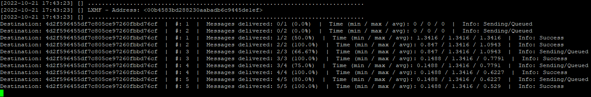

# lxmf_test
Dieses Programm sendet eine einstellbare Anzahl von LXMF-Nachrichten an ein Ziel. Anschließend wird eine einfache Statistik erstellt, um den Erfolg oder Misserfolg einer einzelnen Nachricht zu überprüfen. Dieses Tool kann nützlich sein, um das LXMF/Reticulum-Netzwerk mit einer bestimmten Anzahl von Nachrichten zu belasten. Damit lässt sich eine bestimmte Anzahl von Benutzern simulieren.

Weitere Informationen finden Sie in den Konfigurationsoptionen (am Ende der Programmdateien). Alles Weitere ist dort kurz dokumentiert. Nach dem ersten Start wird diese Konfiguration als Standardkonfiguration in der entsprechenden Datei angelegt.


### Merkmale
- Kompatibel mit allen LXMF-Anwendungen (NomadNet, Sideband, ...)


## Beispiele für die Verwendung

### 

### Allgemeine Informationen zum Transport der Nachrichten
Alle Nachrichten zwischen Client<->Server werden als einzelne 1:1 Nachrichten im LXMF/Reticulum Netzwerk transportiert.
Dementsprechend findet zwischen diesen Endpunkten eine Verschlüsselung statt.
Wenn eine direkte Zustellung der Nachricht nicht funktioniert, wird sie an einen Propagationsknoten gesendet. Dort wird sie zwischengespeichert und kann später vom Client abgerufen werden.

Da es sich um normale LXMF-Nachrichten handelt, kann jede LXMF-fähige Anwendung zur Kommunikation mit der Gruppe verwendet werden.


## Aktueller Status
Die Software befindet sich derzeit noch in der Betaphase und ist noch nicht abgeschlossen.

Alle Kernfunktionen sind implementiert und funktionieren, aber Ergänzungen werden wahrscheinlich auftreten, wenn die reale Nutzung erforscht wird.

Es kann zu Fehlern kommen oder die Kompatibilität nach einem Update ist nicht mehr gewährleistet.

Die vollständige Dokumentation ist noch nicht verfügbar. Aus Zeitmangel kann ich auch nicht sagen, wann diese weiterbearbeitet werden wird.


## Bilder/ Verwendungsbeispiele



## Installations Handbuch

### Installation:
- Installieren Sie alle erforderlichen Voraussetzungen. (Standardinstallation von Reticulum. Nur erforderlich, wenn Reticulum noch nicht installiert ist).
  ```bash
  apt update
  apt upgrade
  
  apt install python3-pip
  
  pip install pip --upgrade
  reboot
  
  pip3 install rns
  pip3 install pyserial netifaces
  
  pip3 install lxmf
  ```
- Ändern Sie die Reticulum-Konfiguration entsprechend Ihren Anforderungen und Ihrem Anwendungsfall.
  ```bash
  nano /.reticulum/config
  ```
- Laden Sie die [Datei](lxmf_test.py) aus diesem Repository herunter.
  ```bash
  wget https://raw.githubusercontent.com/SebastianObi/LXMF-Tools/main/lxmf_test/lxmf_test.py
  ```
- Machen Sie es mit folgendem Befehl ausführbar
  ```bash
  chmod +x lxmf_test.py
  ```

### Starten:
- Start mit
  ```bash
  ./lxmf_test.py
  ```


### Inbetriebnahme Parameter:
```bash
usage: lxmf_test.py [-h] [-p PATH] [-pr PATH_RNS] [-pl PATH_LOG] [-l LOGLEVEL] -d DEST [-t TIME] [-s SIZE] [-c COUNT] [-i INST]

LXMF Test - Sendet periodisch Nachrichten und wertet den Status aus

optionale Argumente:
  -h, --help            diese Hilfemeldung anzeigen und beenden
  -p PATH, --path PATH  Pfad zum alternativen Konfigurationsverzeichnis
  -pr PATH_RNS, --path_rns PATH_RNS
                        Pfad zum alternativen Reticulum-Konfigurationsverzeichnis
  -pl PATH_LOG, --path_log PATH_LOG
                        Pfad zum alternativen Protokollverzeichnis
  -l LOGLEVEL, --loglevel LOGLEVEL
  -d DEST, --dest DEST  Einzelner Ziel-Hash oder ,-getrennte Liste mit Ziel-Hashs oder . für zufälliges Ziel
  -t TIME, --time TIME  Zeit zwischen den Meldungen in Sekunden
  -s SIZE, --size SIZE  Größe (Länge) des Nachrichteninhalts
  -c COUNT, --count COUNT
                        Maximale Anzahl gesendeter Nachrichten (0=no end)
  -i INST, --inst INST  Parallele Instanzen (unterschiedliche Absenderadressen)
```


## FAQ

### Wie kann ich mit der Software beginnen?
Sie sollten den Abschnitt `Installationsanleitung` lesen. Dort ist alles kurz erklärt. Gehen Sie einfach alles von oben nach unten durch :)